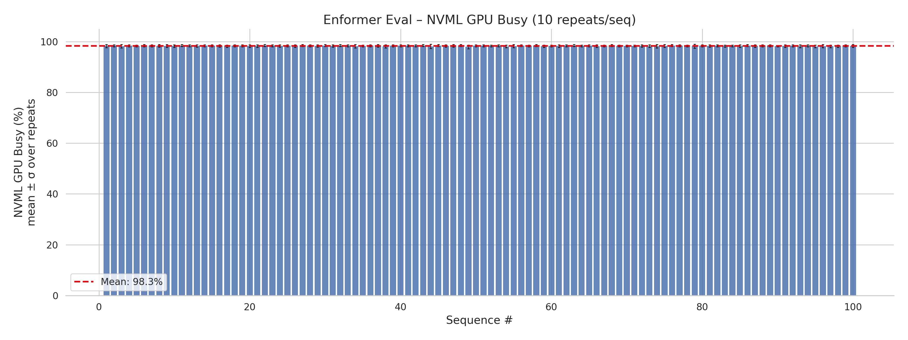

# Enformer GPU Profiling Report

This report presents a comprehensive GPU profiling analysis of
[Enformer](https://www.nature.com/articles/s41592-021-01252-x) inference
using **profgpu**.  The goal is to demonstrate how profgpu's `profile_repeats`
API can characterize GPU behaviour beyond the coarse "GPU busy %" that NVML
reports, including true **FLOPS utilization** as a percentage of peak hardware
throughput.

---

## Experiment Setup

| Parameter | Value |
|-----------|-------|
| **Model** | Enformer (`enformer-pytorch 0.8.11`) |
| **Weights** | `EleutherAI/enformer-official-rough` (HuggingFace) |
| **Parameters** | 251,221,292 (~251 M) |
| **Input** | Random one-hot DNA sequences, 196,608 bp × 4 bases |
| **Batch size** | 1 |
| **Sequences** | 100 |
| **Repeats / sequence** | 10 (with 1 warmup run excluded) |
| **Total forward passes** | 1,000 |
| **Precision** | FP32 (PyTorch default) |
| **GPU** | NVIDIA A10G (Ampere, 24 GB GDDR6X) |
| **Driver / CUDA** | CUDA 12.4, PyTorch 2.6.0 |
| **Profiling tool** | profgpu `profile_repeats()` with NVML backend, 50 ms polling |

### About the Model

Enformer is a deep-learning model for predicting gene expression and chromatin
states from DNA sequence.  It uses a convolutional stem followed by 11
Transformer blocks operating over a 196,608 bp input window and produces 5,313
human and 1,643 mouse genomic tracks.

The model was published by DeepMind (Avsec et al., *Nature Methods* 2021) and
reimplemented in PyTorch by [lucidrains](https://github.com/lucidrains/enformer-pytorch).

---

## How Metrics Are Computed

### FLOP Counting

We use **`torch.utils.flop_counter.FlopCounterMode`** to count the exact
number of floating-point operations in a single forward pass.  This context
manager hooks into every ATen operator and tallies FLOPs analytically (e.g.
matrix multiplications, convolutions, reductions).  For Enformer:

$$
\text{FLOPs per forward pass} = 3{,}293{,}120{,}495{,}616 \approx 3.29 \;\text{TFLOP}
$$

This is more accurate than estimation heuristics (e.g. `2 × MACs`) because it
counts every operator, not just matmuls.

### Peak Hardware TFLOPS

Rather than relying on a hardcoded lookup table of datasheet values, we
**estimate peak TFLOPS programmatically** using two complementary methods:

#### Method 1 — Theoretical (from CUDA device properties)

Every CUDA device exposes its SM count, compute capability, and boost clock
via `torch.cuda.get_device_properties()`.  Combined with a small table mapping
compute capability → FP32 cores per SM, we compute:

$$
\text{Theoretical Peak} = \frac{\text{SMs} \times \text{cores/SM} \times 2_{\text{FMA}} \times \text{clock\_Hz}}{10^{12}}
$$

The `×2` factor accounts for fused multiply-add (each FMA = 2 FLOPs per clock).

| Compute Capability | Architecture | FP32 Cores / SM | Example GPUs |
|:---:|---|:---:|---|
| 7.0 | Volta | 64 | V100 |
| 7.5 | Turing | 64 | T4, RTX 2080 |
| 8.0 | Ampere | 64 | A100 |
| 8.6 | Ampere | 128 | A10G, RTX 3090 |
| 8.9 | Ada Lovelace | 128 | L4, L40, RTX 4090 |
| 9.0 | Hopper | 128 | H100 |

For the A10G (CC 8.6, 80 SMs, 1710 MHz boost):

$$
80 \times 128 \times 2 \times 1.710 \times 10^9 / 10^{12} = 35.0 \;\text{TFLOPS}
$$

#### Method 2 — Empirical GEMM benchmark

The theoretical number assumes every core is busy every cycle, which is never
achievable in practice.  We measure the **realistic peak** by running a large
matrix multiplication (4096 × 4096 FP32, 100 iterations after 20 warmup) that
saturates the GPU's arithmetic units:

```python
def empirical_peak_tflops(device=0, warmup=20, iters=100):
    results = {}
    for n in (2048, 4096, 8192):
        a = torch.randn(n, n, device=f"cuda:{device}")
        b = torch.randn(n, n, device=f"cuda:{device}")
        for label, tf32 in (("fp32", False), ("tf32", True)):
            torch.backends.cuda.matmul.allow_tf32 = tf32
            # ... warmup + timed loop ...
            tflops = (2 * n**3 * iters / elapsed) / 1e12
            results[label] = max(results.get(label, 0), tflops)
    return results   # {"fp32": 23.5, "tf32": 34.1}
```

The function sweeps matrix sizes (2048, 4096, 8192) and tests with TF32
tensor cores both enabled and disabled, returning both peaks.

!!! info "Results on A10G"
    | Method | TFLOPS |
    |--------|:------:|
    | Theoretical (CUDA props) | 35.0 |
    | Empirical FP32 (CUDA cores, TF32=off) | 23.5 |
    | Empirical TF32 (Tensor Cores, TF32=on) | 34.1 |
    | NVIDIA datasheet "FP32" | 31.2 |

    NVIDIA's datasheet "31.2 TFLOPS FP32" actually uses **TF32 Tensor
    Cores** — the inputs and outputs are float32, but the internal multiply
    accumulates at TF32 precision (10-bit mantissa).  With
    `torch.backends.cuda.matmul.allow_tf32 = False` (pure FP32 CUDA cores),
    throughput drops to ~23.5 TFLOPS.

    Since Enformer runs with `allow_tf32 = False` (the default in our
    script), we use the **empirical FP32 peak (23.5 TFLOPS)** as the
    FLOPS utilization ceiling — giving a more honest efficiency number.

### FLOPS Utilization

For each sequence, we compute:

$$
\text{Achieved TFLOPS} = \frac{\text{FLOPs per pass}}{\text{wall-clock time (s)}} \times 10^{-12}
$$

$$
\text{FLOPS Utilization (\%)} = \frac{\text{Achieved TFLOPS}}{\text{Peak TFLOPS}} \times 100
$$

This gives a **true compute-efficiency metric** — what fraction of the GPU's
theoretical maximum throughput your workload actually uses.

### NVML GPU Busy (%)

This is the metric reported by `nvidia-smi` and the NVML API
(`nvmlDeviceGetUtilizationRates`).  It measures the fraction of time *at least
one GPU kernel was running* during the driver's ~1-second sampling window.  A
value of 98% means the GPU was "doing something" 98% of the time — but says
nothing about *how efficiently* the hardware is used.

!!! warning "NVML busy ≠ compute efficiency"
    A kernel that reads one byte from global memory still registers as 100%
    utilization for that sampling window.  FLOPS utilization is the metric
    that actually captures how much of the chip's arithmetic capacity is used.

### Profiling with `profile_repeats`

Each of the 100 sequences is profiled with **10 independent repeats** (plus 1
warmup run that is excluded from statistics).  `profile_repeats` returns a
`MultiRunResult` containing `RunStats` for every metric (mean, std, min, max,
per-run values).  This design:

- Absorbs run-to-run jitter from GPU clock boosting, host scheduling, and
  memory allocator warm-up.
- Provides standard deviations and confidence intervals.
- Lets you distinguish systematic sequence-level variation from random noise.

```python
from profgpu import profile_repeats

result = profile_repeats(
    run_inference,
    repeats=10,
    warmup_runs=1,
    device=0,
    interval_s=0.05,       # 50 ms NVML polling
    sync_fn=torch.cuda.synchronize,
)
# result.util_gpu.mean, result.duration.std, etc.
```

---

## Results

### Aggregate Statistics

| Metric | Value |
|--------|-------|
| **Achieved TFLOPS** | 13.56 TFLOPS |
| **FLOPS Util (vs empirical FP32 peak)** | 57.6% of 23.5 TFLOPS (min 57.4%, max 57.9%) |
| **FLOPS Util (vs datasheet/TF32 peak)** | ~43.5% of 31.2 TFLOPS |
| **NVML GPU Busy** | 98.3% ± 0.1% (min 98%, max 98%) |
| **Peak Memory** | 6,800 MB ± 0 MB |
| **Power Draw** | 240.6 W ± 1.5 W (max 243 W) |
| **Temperature** | 49.0°C ± 1.6°C (max 50°C) |
| **Energy** | 58.44 J ± 0.36 J per inference |
| **Inference Time** | 0.243 s ± 0.000 s per sequence |
| **Repeat σ (time)** | 0.0008 s (extremely low run-to-run variance) |
| **Total Inferences** | 1,000 |

**Key insight:** The achieved throughput is a constant **13.56 TFLOPS**.
Whether that looks like "43.5% efficient" or "57.6% efficient" depends entirely
on which ceiling you compare against:

- **vs NVIDIA datasheet (31.2 TFLOPS):** 43.5% — but this ceiling uses TF32
  Tensor Cores internally, which Enformer doesn't leverage.
- **vs empirical FP32 CUDA-core peak (23.5 TFLOPS):** 57.6% — a fairer
  comparison when the model runs in pure FP32.

Either way, NVML reports 98% "busy" — illustrating that kernel occupancy and
compute efficiency are fundamentally different metrics.

---

### GPU Dashboard

The 2×3 dashboard provides an at-a-glance view of all six key metrics across
all 100 sequences:


---

### FLOPS Utilization per Sequence


FLOPS utilization is remarkably stable at 57.6%, with a spread of only 0.5
percentage points across 100 sequences (min 57.4%, max 57.9%).  This confirms
that Enformer's FP32 forward pass consistently achieves about 13.56 TFLOPS on
the A10G.

---

### NVML GPU Busy per Sequence



NVML reports near-ceiling 98% utilization with negligible run-to-run standard
deviation.  This metric is maximally saturated and provides no differentiation
between workloads.

---

### FLOPS Utilization vs NVML Busy


The scatter plot (left) and comparison bars (right) make the discrepancy
concrete:  NVML says "98% busy" while true compute efficiency is only 57.6%
of the empirical FP32 peak (or 43.5% of the datasheet number).

---

### Peak Memory per Sequence


GPU memory usage is constant at 6,800 MB — Enformer allocates once during the
first forward pass and reuses the same memory pool thereafter.

---

### Power Draw per Sequence


Power draw ramps to ~241 W (the A10G TDP is 300 W, max observed 243 W) with a
slight upward trend as the GPU die temperature increases.

---

### Temperature per Sequence


Temperature rises from ~47°C to ~50°C across the 100 sequences as the thermal
load accumulates, then plateaus (mean 49.0°C ± 1.6°C).

---

### Inference Time Distribution


The left panel shows per-sequence timing with ±1σ error bars from 10 repeats;
the right panel shows the histogram with KDE overlay.  The distribution is
extremely tight around 0.243 s with sub-millisecond variance.

---

## Reproducing This Report

```bash
# Create and activate the environment
conda create -n profgpu python=3.11 -y
conda activate profgpu

# Install dependencies
pip install profgpu[nvml] enformer-pytorch 'transformers<5' \
    torch seaborn matplotlib numpy

# Run the profiling script (default: FP32 precision ceiling)
python examples/enformer_eval_gpu.py

# Or compare against TF32 peak
PRECISION=tf32 python examples/enformer_eval_gpu.py
```

Output figures are saved to `examples/enformer_gpu_results/`.

---

## Source Code

The full script is at
[`examples/enformer_eval_gpu.py`](https://github.com/omids-cerebras/profgpu/blob/main/examples/enformer_eval_gpu.py).
